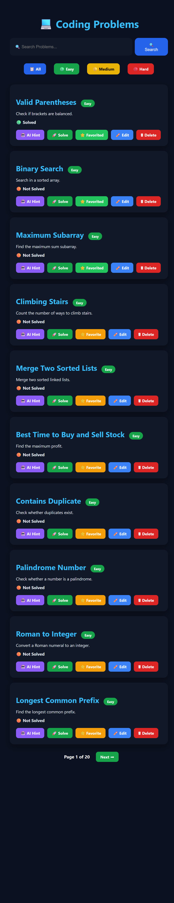

# 🚀 CodeVision-AI

CodeVision-AI is an AI-powered coding practice platform inspired by LeetCode. It helps users practice coding problems, track their progress, save favorite problems, earn achievements, and improve their programming skills through an interactive and user-friendly interface.

---

## ✨ Features

- 🔐 User Authentication (Login & Registration)
- 🏠 Interactive Dashboard
- 📚 Coding Problems Collection
- ❤️ Favorite Problems
- 👤 User Profile
- 📈 Progress Tracking
- 🏆 Leaderboard
- 🎖️ Achievement Badges
- 📊 Coding Statistics
- 💾 SQLite Database
- 🎨 Responsive User Interface

---

## 🛠️ Tech Stack

### Frontend
- HTML5
- CSS3
- JavaScript

### Backend
- Python
- Flask

### Database
- SQLite

---

## 📂 Project Structure

```text
CodeVision-AI/
│
├── static/
├── templates/
├── app.py
├── database.db
├── requirements.txt
└── README.md
```

---

## 📸 Screenshots

### 🔐 Login Page


---

### 🏠 Dashboard


---

### 📚 Problems Page



---

### ❤️ Favorite Problems


---

### 👤 Profile Page


---

### ✅ Solve Problem


---

## ⚙️ Installation

### 1. Clone the Repository

```bash
git clone https://github.com/avan-tika28/CodeVision-AI.git
```

### 2. Navigate to the Project Folder

```bash
cd CodeVision-AI
```

### 3. Install Dependencies

```bash
pip install -r requirements.txt
```

### 4. Run the Application

```bash
python app.py
```

### 5. Open Your Browser

```
http://127.0.0.1:5000
```

---

## 🎯 Future Enhancements

- 🤖 AI Coding Assistant
- 💻 Online Code Compiler
- 🏅 Daily Coding Challenges
- 📈 Personalized Learning Recommendations
- 🌙 Dark Mode
- 👥 Coding Contest Mode
- 📱 Mobile Responsive Design

---

## 👩‍💻 Developer

**Avantika R**

B.Tech – Artificial Intelligence & Data Science

GitHub: https://github.com/avan-tika28

---

## 📜 License

This project was developed for educational and learning purposes.

---

## ⭐ Support

If you found this project helpful, please consider giving it a ⭐ on GitHub.

Your support motivates me to build more useful and exciting projects!
