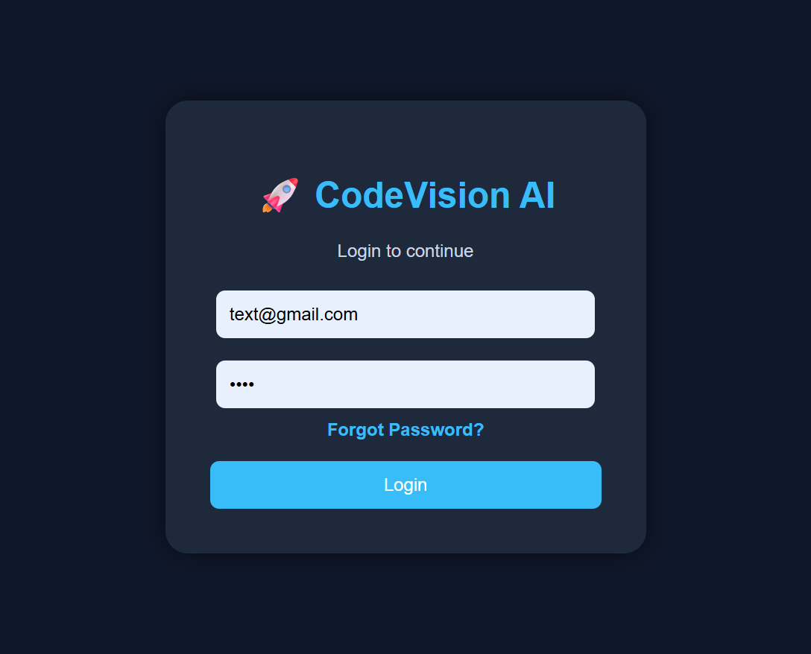
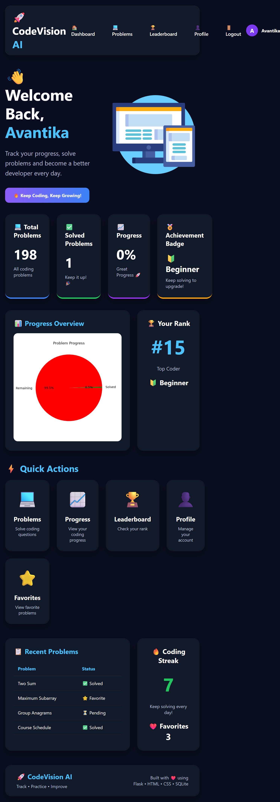
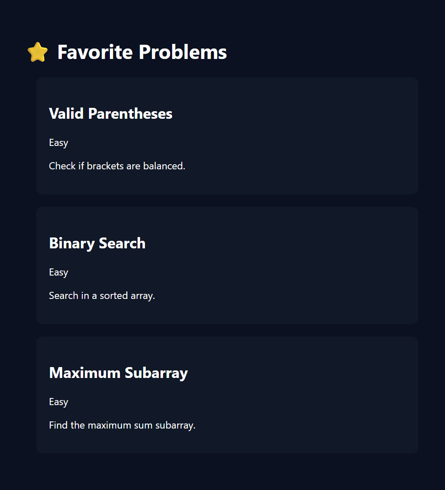
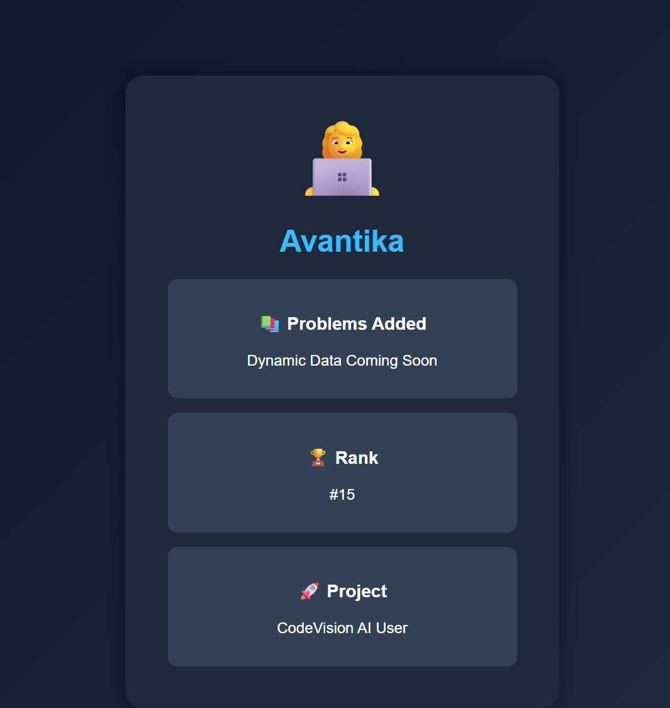
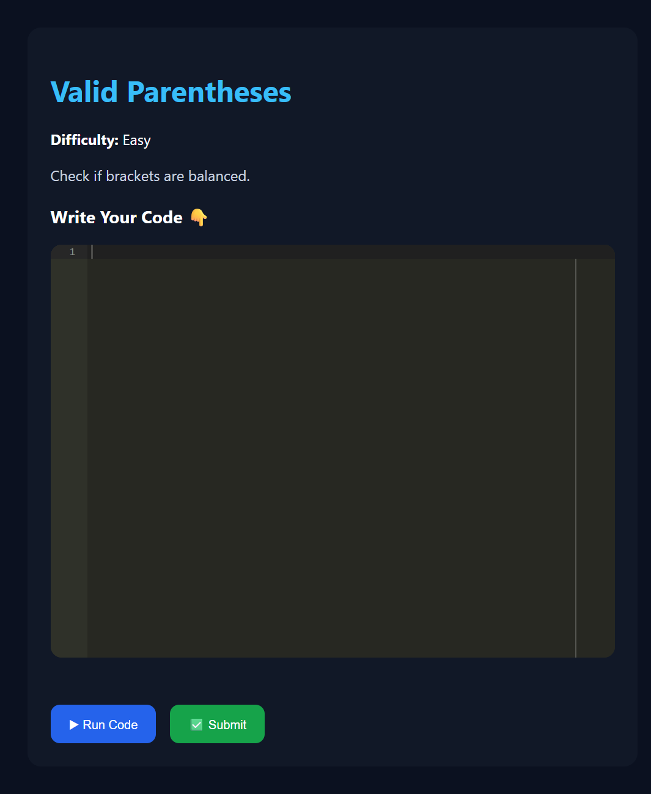

# 🚀 CodeVision-AI

An AI-powered coding practice platform inspired by LeetCode. CodeVision-AI helps users practice coding, track their progress, earn achievements, and improve their problem-solving skills through a clean and interactive interface.

---
## 🌐 Live Demo

https://codevision-ai-b0ll.onrender.com

# ✨ Features

- 🔐 User Login & Registration
- 🏠 Interactive Dashboard
- 📚 Coding Problems Collection
- ❤️ Favorite Problems
- 👤 User Profile
- 📈 Progress Tracking
- 🏆 Leaderboard
- 🎖️ Achievement Badges
- 📊 Coding Statistics
- 💾 SQLite Database
- 🎨 Modern Responsive UI

---

# 🛠️ Tech Stack

## Frontend
- HTML5
- CSS3
- JavaScript

## Backend
- Python
- Flask

## Database
- SQLite

---

# 📂 Project Structure

```text
CodeVision-AI/
│
├── screenshots/
│   ├── login.png
│   ├── dashboard.png
│   ├── problems.png
│   ├── favorites.png
│   ├── profile.png
│   └── solve.png
│
├── static/
├── templates/
├── data/
├── app.py
├── requirements.txt
├── database.db
└── README.md
```

---

# 📸 Screenshots

## 🔐 Login Page



---

## 🏠 Dashboard



---

## 📚 Problems Page


---

## ❤️ Favorite Problems



---

## 👤 Profile



---

## ✅ Solve Problem



---

# ⚙️ Installation

### 1. Clone the Repository

```bash
git clone https://github.com/avan-tika28/CodeVision-AI.git
```

### 2. Navigate to the Project Folder

```bash
cd CodeVision-AI
```

### 3. Install Dependencies

```bash
pip install -r requirements.txt
```

### 4. Run the Application

```bash
python app.py
```

### 5. Open Your Browser

```
http://127.0.0.1:5000
```

---

# 🎯 Future Enhancements

- 🤖 AI Coding Assistant
- 💻 Online Code Compiler
- 🏅 Daily Coding Challenges
- 🌙 Dark Mode
- 👥 Coding Contest Mode
- 📈 Personalized Learning Recommendations

---

# 👩‍💻 Developer

**Avantika R**

**B.Tech – Artificial Intelligence & Data Science**

GitHub Profile:
https://github.com/avan-tika28

---

# 📜 License

This project is created for educational and learning purposes.

---

# ⭐ Support

If you like this project, don't forget to ⭐ star the repository.

It motivates me to build more exciting projects!
